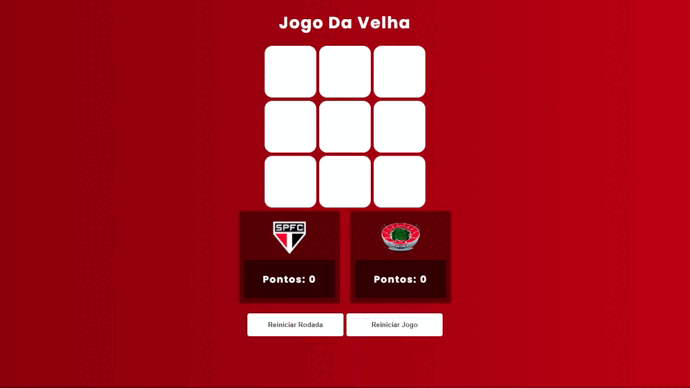

 s <p align="center">
    
  </p>
  
  ## :clipboard: Sobre o Projeto
  
  Esse projeto foi realizado a alguns meses atrás durante o curso [ProgramadorBR](https://programadorbr.com) aonde estávamos aprendendo sobre as tecnologias utilizadas neste projeto. Resolvi tematizar o jogo e usei como o designer do jogo fazer com o meu time do coração o São Paulo FC, então resolvi colocar como equivalente a letra X num jogo da velha tradicional o escudo do time, e com a letra O o estadio do São Paulo o Morumbi.
 
  Espero que gostem, e se divirtam-se! ❤️🤍🖤
  
  <br>
  <p align="center">
    
  </p>
  <br>
  
# 🔗 Acesse o site com o link abaixo. 

- [Jogo Da Velha](https://degabrielofi.github.io/JogoDaVelha)


## :computer: Tecnologias utilizadas
  
 O projeto foi desenvolvido utilizando as seguintes tecnologias:
  
 - [HTML](https://developer.mozilla.org/pt-BR/docs/Web/HTML)
 - [CSS](https://developer.mozilla.org/pt-BR/docs/Web/CSS)
 - [JavaScript](https://www.javascript.com/)

## 🕵️‍♂️ Para clonar o repositório utilize:
```bash
 git clone https://github.com/degabrielofi/JogoDaVelha
```

 ## 

## 😃 Se achou legal? Dá uma olhada lá no > [Likedln](https://www.linkedin.com/in/degabrielofi/)


 <p align="center">
    
  </p>

